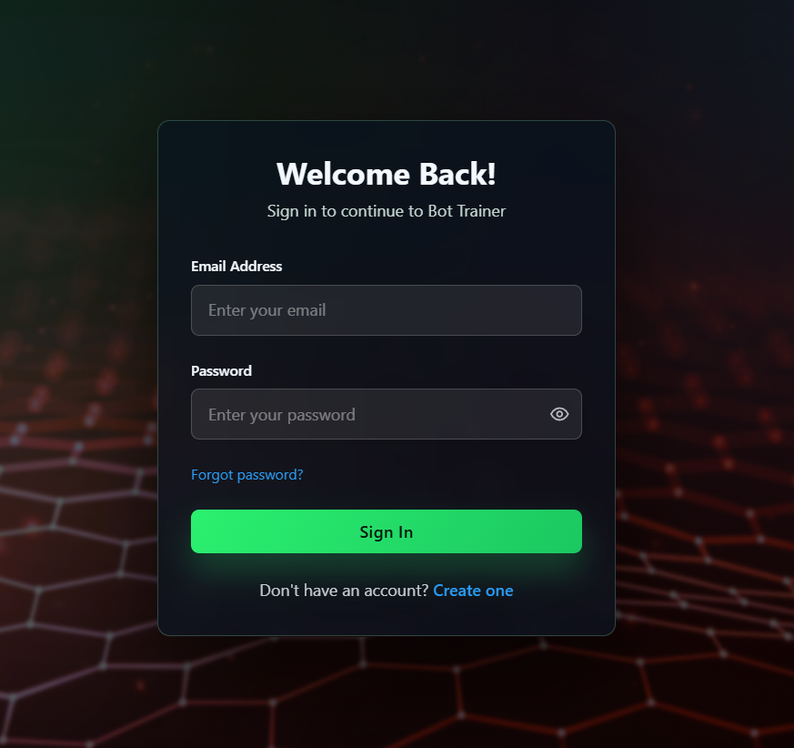
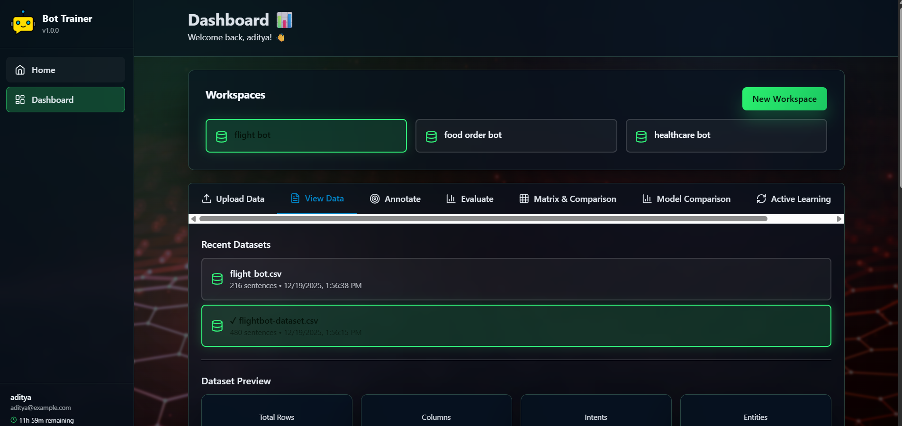
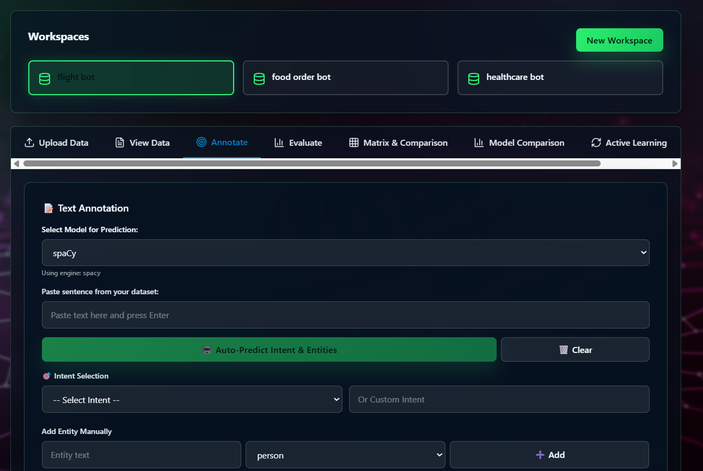
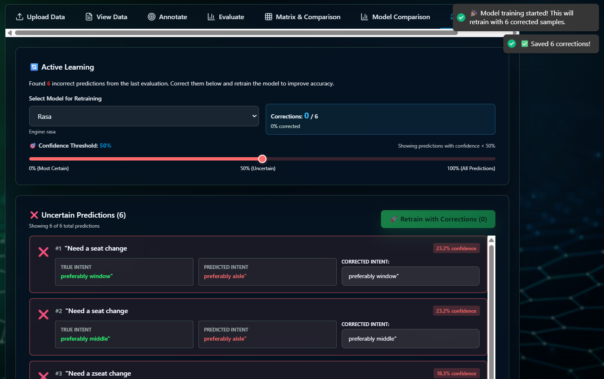
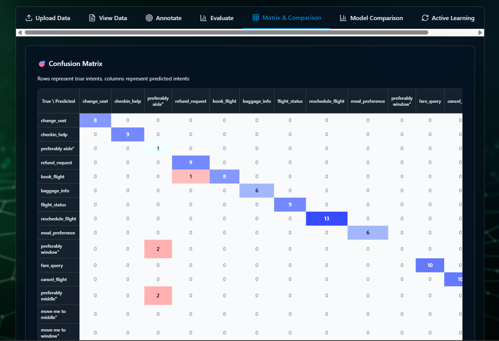
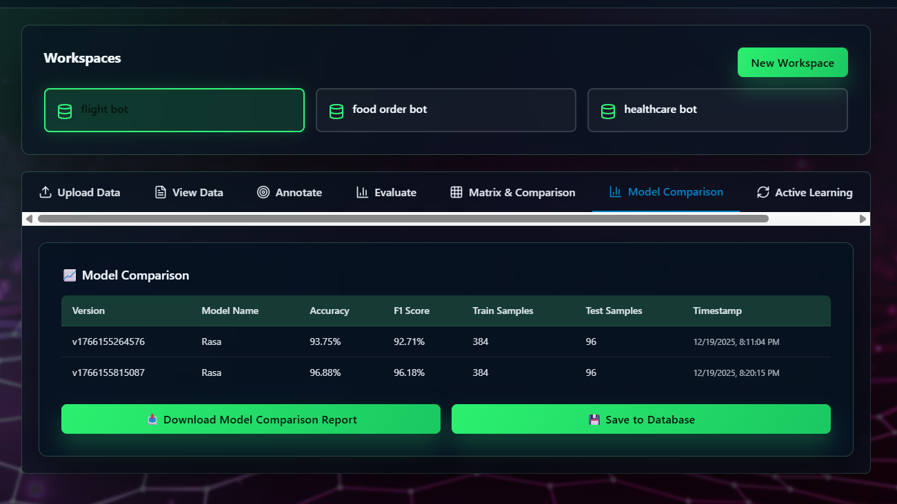
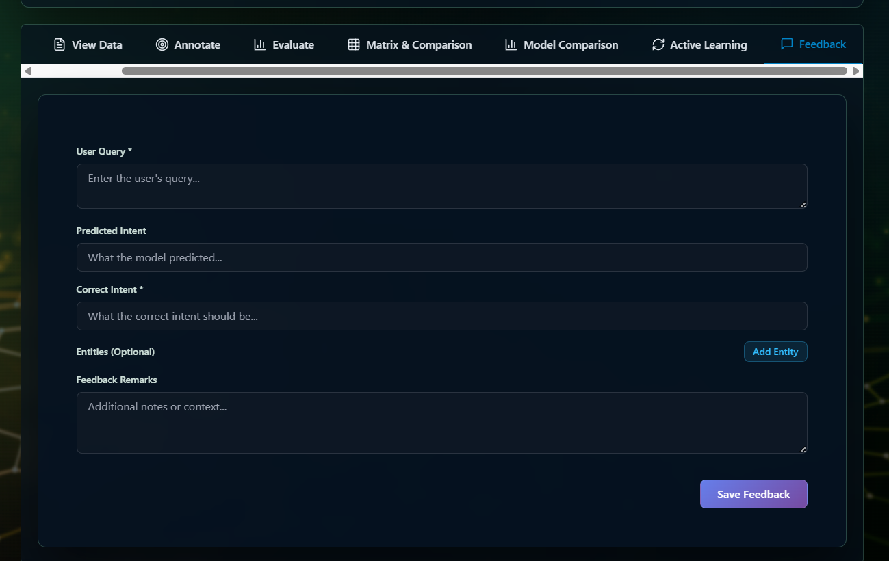
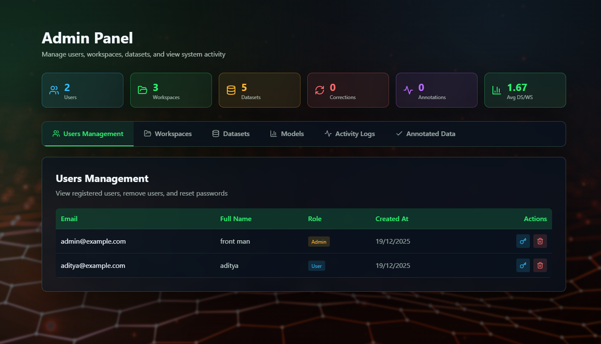

# 🤖 Bot Trainer NLU

A comprehensive Natural Language Understanding (NLU) training platform for building, training, and evaluating conversational AI models. This application provides a complete workflow for dataset management, model training, evaluation, and active learning.

## 📋 Table of Contents

- [Features](#-features)
- [Tech Stack](#-tech-stack)
- [Prerequisites](#-prerequisites)
- [Installation](#-installation)
- [Configuration](#-configuration)
- [Running the Application](#-running-the-application)
- [Initial Setup](#-initial-setup)
- [Project Structure](#-project-structure)
- [Usage Guide](#-usage-guide)
- [API Documentation](#-api-documentation)
- [Screenshots](#-screenshots)
- [Troubleshooting](#-troubleshooting)
- [Contributing](#-contributing)
- [License](#-license)

## ✨ Features

### Core Features
- 🔐 **User Authentication** - Secure JWT-based authentication with admin roles
- 💼 **Workspace Management** - Organize projects with multiple workspaces
- 📊 **Dataset Management** - Upload, analyze, and manage training datasets (CSV, JSON, TXT)
- 🎯 **Data Annotation** - Built-in annotation interface for labeling data
- 🧠 **Multi-Model Training** - Support for spaCy, Rasa, and NERT (CRF) models
- 📈 **Model Evaluation** - Comprehensive evaluation metrics and confusion matrices
- 🔄 **Active Learning** - Intelligent sample selection for iterative improvement
- 💬 **Feedback System** - User feedback collection on model predictions
- 👥 **Admin Panel** - User management and system monitoring
- 🔍 **Model Comparison** - Side-by-side comparison of different models

### Supported NLU Tasks
- Intent Classification
- Named Entity Recognition (NER)
- Text Classification
- Custom entity extraction

## 🛠️ Tech Stack

### Backend
- **FastAPI** - High-performance Python web framework
- **MongoDB** - NoSQL database for data storage
- **spaCy** - Industrial-strength NLP library
- **scikit-learn** - Machine learning toolkit
- **NLTK** - Natural language processing
- **bcrypt** - Password hashing
- **PyJWT** - JSON Web Token authentication

### Frontend
- **React 18** - Modern UI library
- **Vite** - Fast build tool
- **Tailwind CSS** - Utility-first CSS framework
- **Zustand** - Lightweight state management
- **Axios** - HTTP client
- **React Router** - Client-side routing
- **React Hot Toast** - Toast notifications
- **Lucide React** - Beautiful icons

## 📦 Prerequisites

Before you begin, ensure you have the following installed on your system:

### Required Software
- **Python 3.8+** - [Download Python](https://www.python.org/downloads/)
- **Node.js 18+** - [Download Node.js](https://nodejs.org/)
- **MongoDB 4.4+** - [Download MongoDB](https://www.mongodb.com/try/download/community)
- **Git** - [Download Git](https://git-scm.com/downloads)

### Check Your Installations
```bash
# Check Python version
python --version

# Check Node.js version
node --version

# Check npm version
npm --version

# Check MongoDB is running
mongosh --eval "db.version()"
```

## 🚀 Installation

### Step 1: Clone the Repository
```bash
git clone https://github.com/yourusername/bot_trainer_nlu.git
cd bot_trainer_nlu
```

### Step 2: Backend Setup

#### 2.1 Create Python Virtual Environment
```bash
# Windows
python -m venv .venv
.venv\Scripts\activate

# macOS/Linux
python3 -m venv .venv
source .venv/bin/activate
```

#### 2.2 Install Python Dependencies
```bash
pip install -r requirements.txt
```

#### 2.3 Download spaCy Language Model
```bash
python -m spacy download en_core_web_sm
```

#### 2.4 Download NLTK Data
```bash
python -c "import nltk; nltk.download('punkt'); nltk.download('stopwords')"
```

### Step 3: Frontend Setup

#### 3.1 Navigate to Frontend Directory
```bash
cd frontend
```

#### 3.2 Install Node Dependencies
```bash
npm install
```

### Step 4: MongoDB Setup

#### 4.1 Start MongoDB Service
```bash
# Windows (as Administrator)
net start MongoDB

# macOS
brew services start mongodb-community

# Linux
sudo systemctl start mongod
```

#### 4.2 Verify MongoDB is Running
```bash
mongosh --eval "db.version()"
```

## ⚙️ Configuration

### Backend Configuration

Create a `.env` file in the `backend/` directory:

```bash
cd backend
```

Create `backend/.env` file with the following content:
```env
# MongoDB Configuration
MONGO_URI=mongodb://localhost:27017
DB_NAME=bot_trainer

# JWT Configuration
JWT_SECRET=your-super-secret-jwt-key-change-this-in-production
JWT_ALGO=HS256
JWT_EXPIRY_HOURS=12

# Email Configuration (Optional - for password reset)
EMAIL_HOST=smtp.gmail.com
EMAIL_PORT=587
EMAIL_USER=your-email@gmail.com
EMAIL_PASSWORD=your-app-password
```

⚠️ **Important:** Change `JWT_SECRET` to a strong, unique value in production!

### Frontend Configuration

Create a `.env` file in the `frontend/` directory:

```bash
cd ../frontend
```

Create `frontend/.env` file with the following content:
```env
# API Base URL
VITE_API_BASE_URL=http://127.0.0.1:8000
```

## 🏃 Running the Application

### Step 1: Start MongoDB
Make sure MongoDB is running (see [MongoDB Setup](#41-start-mongodb-service))

### Step 2: Start Backend Server

```bash
# Navigate to project root
cd bot_trainer_nlu

# Activate virtual environment (if not already activated)
# Windows
.venv\Scripts\activate
# macOS/Linux
source .venv/bin/activate

# Start FastAPI server
cd backend
uvicorn main:app --reload --host 127.0.0.1 --port 8000
```

Backend will be available at: `http://127.0.0.1:8000`

### Step 3: Start Frontend Development Server

Open a **new terminal** and run:

```bash
# Navigate to frontend directory
cd bot_trainer_nlu/frontend

# Start Vite development server
npm run dev
```

Frontend will be available at: `http://localhost:5173` (or the port shown in terminal)

### Step 4: Access the Application

Open your browser and navigate to:
- **Frontend:** http://localhost:5173
- **Backend API Docs:** http://127.0.0.1:8000/docs

## 🔑 Initial Setup

### Create Admin User

After starting the backend, create an admin user:

```bash
# In a new terminal, navigate to backend directory
cd bot_trainer_nlu/backend

# Activate virtual environment
# Windows
..\.venv\Scripts\activate
# macOS/Linux
source ../.venv/bin/activate

# Run admin creation script
python add_admin.py
```

**Default Admin Credentials:**
- Email: `admin@example.com`
- Password: `admin@123`
- Username: `front man`

⚠️ **Important:** Change these credentials after first login!

### First Login

1. Navigate to `http://localhost:5173`
2. Click "Login"
3. Use the admin credentials above
4. Change your password in the admin panel

## 📁 Project Structure

```
bot_trainer_nlu/
├── backend/
│   ├── main.py                 
│   ├── config.py               
│   ├── database.py             
│   ├── models.py               
│   ├── auth.py                 
│   ├── add_admin.py            
│   ├── requirements.txt        
│   ├── routes/                 
│   │   ├── auth_routes.py
│   │   ├── workspace_routes.py
│   │   ├── dataset_routes.py
│   │   ├── train_routes.py
│   │   ├── nlu_routes.py
│   │   ├── evaluation_routes.py
│   │   ├── active_learning_routes.py
│   │   ├── feedback_routes.py
│   │   ├── admin_routes.py
│   │   └── ...
│   └── saved_models/           # Trained model storage (gitignored)
├── frontend/
│   ├── src/
│   │   ├── main.jsx            
│   │   ├── App.jsx             
│   │   ├── pages/              
│   │   │   ├── HomePage.jsx
│   │   │   ├── LoginPage.jsx
│   │   │   ├── RegisterPage.jsx
│   │   │   ├── DashboardPage.jsx
│   │   │   └── AdminPanelPage.jsx
│   │   ├── components/         
│   │   │   ├── Sidebar.jsx
│   │   │   ├── auth/
│   │   │   └── common/
│   │   ├── services/         
│   │   │   ├── api.js
│   │   │   ├── authService.js
│   │   │   ├── workspaceService.js
│   │   │   ├── datasetService.js
│   │   │   └── ...
│   │   └── store/              
│   │       ├── authStore.js
│   │       ├── workspaceStore.js
│   │       └── datasetStore.js
│   ├── package.json            
│   ├── vite.config.js          
│   └── tailwind.config.js      
├── screenshots/                 
├── uploaded_files/              
├── .gitignore                  
└── README.md                    
```

## 📖 Usage Guide

### 1. Create a Workspace
- Navigate to Dashboard
- Click "Create Workspace"
- Enter workspace name and description
- Select the workspace to activate it

### 2. Upload Dataset
- Go to "Upload Data" tab
- Choose file format (CSV, JSON, or TXT)
- Upload your dataset
- View dataset analysis and statistics

### 3. Annotate Data (Optional)
- Navigate to "Annotate" tab
- Label your data with intents and entities
- Save annotations

### 4. Train Model
- Go to "Evaluate" tab
- Select model type (spaCy, Rasa, or NERT)
- Configure training parameters
- Click "Train Model"
- Monitor training progress

### 5. Evaluate Model
- View evaluation metrics (accuracy, precision, recall, F1)
- Examine confusion matrix
- Analyze per-class performance
- Compare different models

### 6. Active Learning
- Review model predictions
- Correct misclassified samples
- Add corrections to training data
- Retrain for improved performance

### 7. Collect Feedback
- Test model with real queries
- Provide feedback on predictions
- Track feedback history

## 📚 API Documentation

Once the backend is running, access the interactive API documentation:

- **Swagger UI:** http://127.0.0.1:8000/docs
- **ReDoc:** http://127.0.0.1:8000/redoc

### Key API Endpoints

#### Authentication
- `POST /register` - Register new user
- `POST /login` - User login
- `POST /forgot-password` - Request password reset

#### Workspaces
- `GET /workspaces` - List all workspaces
- `POST /workspaces` - Create new workspace
- `POST /workspaces/select` - Select active workspace

#### Datasets
- `POST /datasets/save` - Save uploaded dataset
- `GET /datasets` - List all datasets
- `POST /datasets/select` - Select active dataset

#### Training
- `POST /train` - Start model training
- `GET /train/status` - Get training status

#### NLU
- `POST /nlu/predict` - Make predictions
- `POST /nlu/test` - Test model

## 🖼️ Screenshots

### Login Page

*User authentication interface*

### Dashboard

*Main workspace and dataset management*

### Annotate

*Annotation page*

### Evaluation Page

*Model performance*

### Model Training

*Model training interface*

### Matrix & Comparison

*Matrix and comparison page*

### Model Comparison

*Model comparison page*

### Feedback

*Feedback page*

### Admin Panel

*User and system management*


**Made with ❤️ for the NLU community**
**if this project will help you, give a star to this repo**
